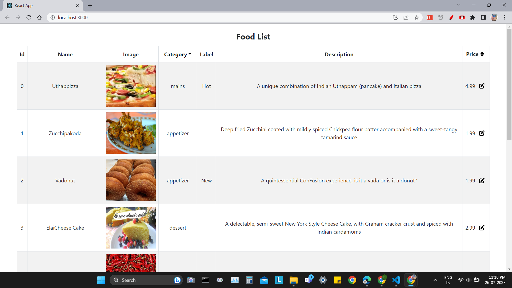

## Run the app
1. run **npm install**

    run these commands in terminal if you find error of fortawesome 
    **npm i --save @fortawesome/fontawesome-svg-core**  
    **npm install --save @fortawesome/free-solid-svg-icons**  
    **npm install --save @fortawesome/react-fontawesome**

2. run **json-server --watch db.json --port 3001**
3. run **npm start** in a new terminal window (this will launch your React application)

Screenshot of running app:
